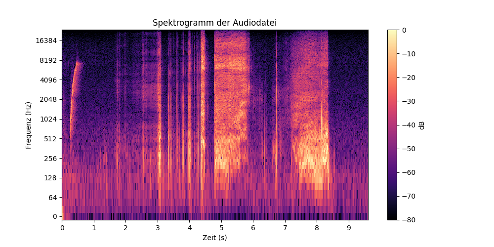

# Vibroakustische Signalverarbeitung
## Projektüberblick

Das Ziel dieses Projekts besteht darin, vibroakustische Signale, die während der Punktion von Gewebeschichten entstehen, aufzunehmen, zu analysieren und visuell darzustellen.
Im Rahmen eines Laboraufbaus werden diese Signale mithilfe spezieller Mikrofone erfasst und anschließend mit Methoden der digitalen Signalverarbeitung ausgewertet. Ziel ist es, die entstehenden akustischen Muster sichtbar zu machen und deren Eigenschaften besser zu verstehen.

---

## Versuchsaufbau

Es wurde ein Laboraufbau realisiert, der es ermöglicht, die akustischen Signale sichtbar zu machen, die bei der Punktion verschiedener Gewebeschichten eines Versuchstieres (Manduca) entstehen.
Eine spezielle Nadel ist mit einem Mikrofon verbunden, das die beim Eindringen in das Gewebe entstehenden vibroakustischen Signale direkt aufnimmt und messbar macht.

Zusätzlich wird ein zweites Mikrofon verwendet, um die Umgebungsgeräusche außerhalb des Experiments zu erfassen. Ergänzend wird der gesamte Versuch mit einer Kamera aufgezeichnet, um die während der Durchführung entstehenden Geräusche visuell zu dokumentieren.

---

## Teilziele

Die Signalverarbeitung verfolgt insbesondere folgende Ziele:

* Visualisierung von Audiosignalen im Zeitbereich (Waveform)
* Analyse von Mono- und Stereo-Signalen
* Berechnung der Amplitudenhüllkurve
* Darstellung von Frequenzanteilen mittels Spektrogramm
* Anwendung grundlegender Methoden der digitalen Signalverarbeitung

  ---
  
## Technologiestack

* Python 3
* NumPy für numerische Berechnungen
* SciPy für Signalverarbeitung
* Matplotlib zur Visualisierung
* Librosa für Audioanalyse und Spektrogramme

  ---
  
## Projektstruktur (Auszug)

Vibroakustische-Signalverarbeitung/

├─ audio.wav

├─ Waveform.eines.Audiosignals.py

├─ Waveform.eines.Audiosignals(Channel-1).py

├─ AmplitudeEnvelope(Geglättet).py 

├─ amplitudedarstellen.py 

├─ spektrogramm_darstellen.py

├─ spektrogramm_darstellen1.py

└─ README.md

Die Struktur ist modular aufgebaut und ermöglicht eine klare Trennung zwischen den verschiedenen Analysearten.

## Voraussetzungen

* Python 3 installiert
* Grundkenntnisse in Signalverarbeitung (optional)
* Eine Audiodatei im WAV-Format
  
## Erweiterte Funktionen

* Darstellung einzelner Audiokanäle
* Glättung der Amplitudenhüllkurve mittels Tiefpassfilter
* Zeit-Frequenz-Analyse durch STFT
  
## Ergebnisse und Nutzen

Die entwickelten Analyseverfahren ermöglichen eine detaillierte Untersuchung vibroakustischer Signale. Durch die Visualisierung im Zeit- und Frequenzbereich können charakteristische Muster identifiziert und interpretiert werden.

Das Projekt trägt dazu bei, die akustischen Eigenschaften von Gewebeinteraktionen besser zu verstehen und bildet eine Grundlage für weiterführende Analysen.

## Ausblick

Mögliche zukünftige Erweiterungen umfassen:

* Echtzeit-Signalverarbeitung
* Integration von Machine Learning zur Mustererkennung
* Entwicklung einer grafischen Benutzeroberfläche
* Erweiterung auf weitere Sensordaten
  
## Autor

Franck Carmel Tsafack Dongmo
Masterstudent – Informatik

